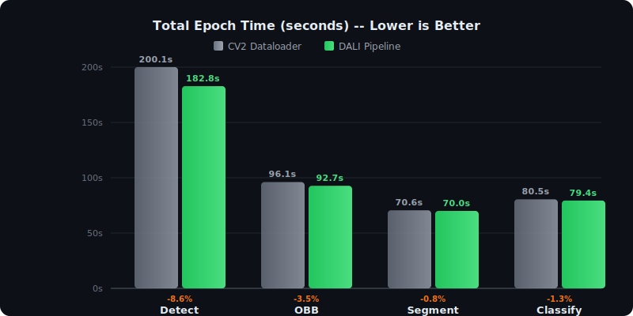
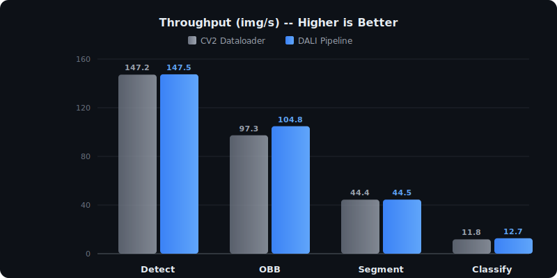

# Performance Benchmark: NVIDIA DALI vs Standard CV2 Dataloader

Benchmark results for the **`ultralytics_dali`** package, comparing the standard OpenCV (cv2) dataloader against NVIDIA DALI in terms of processing speed and epoch completion time.

## Benchmark Datasets

All benchmarks were run on real-world image datasets:

| Task | Dataset |
| :--- | :--- |
| Detection | [Helmet Detection](https://universe.roboflow.com/imagerecognition-43zpb/helmet-detection-ntbfz/dataset/6) |
| OBB | [Oriented K1AAB](https://universe.roboflow.com/chariot-0khf8/oriented-k1aab/dataset/1) |
| Segmentation | [Motorcycle Traffic Intersection](https://universe.roboflow.com/pibulsongkarm-rajabhat-university-ifzi7/motorcycle_traffic_intersection_model-9zgnv/dataset/10) |
| Classification | [fincls](https://universe.roboflow.com/azmain-mahtab-and-jannatim-maisha/fincls/dataset/4) |

---

## Results at a Glance

  

  

| Task | CV2 (s) | DALI (s) | Delta | Throughput (DALI / CV2) | Quality Guard |
| :--- | :---: | :---: | :---: | :---: | :---: |
| Detect | 200.05 | 182.83 | **-17.22 (8.6%)** | 147.48 / 147.21 img/s | Passed |
| OBB | 96.08 | 92.71 | **-3.37 (3.5%)** | 104.79 / 97.32 img/s | Passed |
| Segment | 70.57 | 70.00 | -0.56 (0.8%) | 44.46 / 44.41 img/s | Passed |
| Classify | 80.50 | 79.40 | -1.10 (1.3%) | 12.67 / 11.76 img/s | Passed |

All tasks passed the Quality Guard -- loss curves, mAP, and accuracy metrics matched the CV2 baseline exactly.

---

## Key Takeaways

- DALI consistently reduces total wall-clock time per epoch, with the biggest gains in Detection and OBB.
- Model quality stays identical across all tasks. No metric degradation was observed.
- In Segmentation, DALI does speed up the raw training phase, but disk I/O during save/validation masks the improvement. There's room for further optimization here.

---

## Why Detection saw the biggest speedup

The Detection task gained **-17.22s** per epoch, which stood out from the rest. A few things explain why:

1. Detection pipelines rely heavily on spatial augmentations like Mosaic, MixUp, and geometric bbox transforms. These are expensive on the CPU.
2. DALI moves all of that to the GPU, eliminating the CPU bottleneck entirely.
3. With the CPU freed up, validation and model checkpoint saving also ran faster -- the speedup cascaded through the whole epoch.

---

## Per-Task Breakdown

### Detection

DALI cut the most time here (-17.22s). Raw image throughput was roughly the same between the two loaders, but the real gain came from reduced overhead during validation and saving. With the CPU no longer saturated by augmentations, everything else got faster too.

### OBB (Oriented Bounding Box)

Throughput improved noticeably -- 97.3 img/s (CV2) to 104.8 img/s (DALI). The angle-aware preprocessing in OBB is a good fit for GPU acceleration, and the total epoch time dropped by 3.37s.

### Segmentation

The training phase itself was about 2.5s faster with DALI, but save and validation overhead ate into the gains. The final delta came out to just -0.56s. This is a case where the bottleneck has shifted from data loading to disk I/O.

### Classification

Essentially a wash (-1.10s). DALI holds a small throughput edge (12.67 vs 11.76 img/s) but classification pipelines are light enough that there isn't much room for DALI to make a big difference. Quality remained stable.

---

*Generated by the ultralytics_dali Benchmark Suite.*
